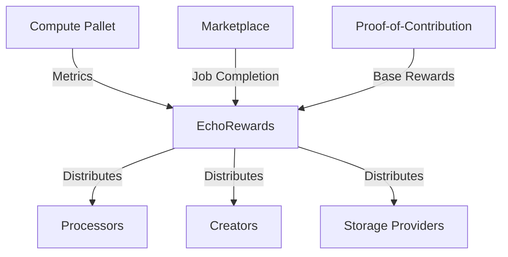

# EchoChain Reward System Documentation

## Architecture Overview


## Configuration

### Runtime Integration
```rust
impl echorewards::Config for Runtime {
    type Currency = Balances;
    type ComputePallet = Compute;
    type MarketplacePallet = Marketplace;
    type ContributionPallet = ProofOfContribution;
    // ... other configs
}
```

## Reward Types

1. **Compute Rewards**  
   Based on processor metrics:
   ```rust
   fn calculate_reward(metrics: ProcessorMetrics) -> Balance {
       // Custom reward logic
   }
   ```

2. **Marketplace Rewards**  
   Job completion payouts:
   ```rust
   fn pay_reward(job_id, amount, recipient) -> Result<(), Error>
   ```

3. **Contribution Rewards**  
   Periodic distributions:
   ```rust
   fn distribute_content_rewards()
   fn distribute_network_rewards()  
   ```

## Usage Examples

### Compute Reward Claim
```rust
let reward = EchoRewards::claim_compute_reward(processor);
```

### Marketplace Payout
```rust
EchoRewards::pay_marketplace_reward(job_id, amount, creator);
```

### Contribution Reporting
```rust
ProofOfContribution::report_network_contribution(
    origin, 
    storage_bytes, 
    bandwidth_bytes
);
```

## Integration Guide

1. Implement required traits:
   ```rust
   impl ComputeRewardDistributor for EchoRewards { ... }
   impl RewardManager for EchoRewards { ... }
   ```

2. Add pallet to runtime:
   ```rust
   construct_runtime!{
       // ...
       EchoRewards: echorewards::{Pallet, Call, Storage, Event<T>},
   }
   ```

3. Configure weights:
   ```rust
   impl echorewards::WeightInfo for RuntimeWeight {
       fn claim_reward() -> Weight { ... }
   }
