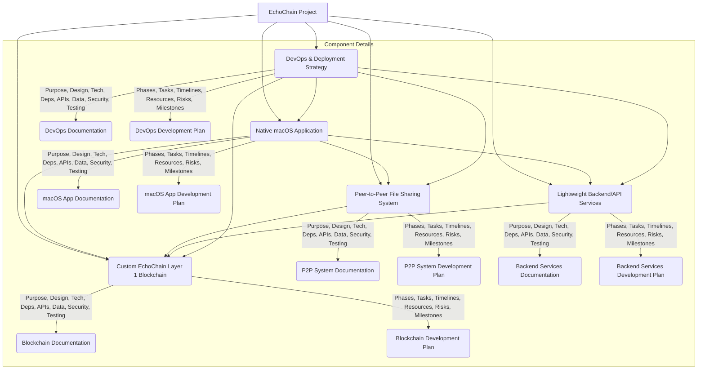

# EchoChain Project: Comprehensive Technical Documentation and Detailed Development Plans

---

## Usage, Building, and Development (Updated July 2024)

- For high-level usage, building, and development instructions, see the main [README.md](./README.md).
- Each subproject contains a dedicated README with setup, build, and usage details.
- This document provides in-depth technical documentation and development plans for each major component of the EchoChain project.

---

This document outlines the comprehensive technical documentation and detailed development plans for each distinct functional and architectural component of the EchoChain project, a Decentralized Music Sample Marketplace.

## Overall Approach

The task is broken down into two main deliverables for each component: **Technical Documentation** and a **Development Plan**. Each will follow a standardized structure to ensure consistency and completeness across all components.

### Standard Structure for Technical Documentation

For each component, the technical documentation will cover:

*   **1. Purpose:** A clear, concise description of the component's role and objectives within the EchoChain ecosystem.
*   **2. Architectural Design:**
    *   High-level overview and detailed breakdown of its internal structure.
    *   Design patterns and principles applied.
    *   Interaction diagrams (e.g., sequence, component diagrams) if beneficial.
*   **3. Core Technologies Utilized:**
    *   Programming languages, frameworks, libraries, and tools.
    *   Rationale for technology choices.
*   **4. External and Internal Dependencies:**
    *   External services, APIs, or third-party libraries.
    *   Internal dependencies on other EchoChain components.
    *   Dependency management strategy.
*   **5. API Specifications (if applicable):**
    *   Detailed endpoints, request/response formats, authentication mechanisms.
    *   Examples for key operations.
*   **6. Relevant Data Models (if applicable):**
    *   Schema definitions, relationships, and data flow.
    *   Storage mechanisms.
*   **7. Security Implications:**
    *   Identified vulnerabilities and mitigation strategies.
    *   Authentication, authorization, data encryption, and access control.
*   **8. Robust Testing Strategy:**
    *   Unit, integration, system, and performance testing approaches.
    *   Tools and frameworks for testing.
    *   Test coverage goals.

### Standard Structure for Development Plan

For each component, the development plan will delineate:

*   **1. Phases:** Logical breakdown of the development lifecycle (e.g., Design, Implementation, Testing, Deployment).
*   **2. Specific Tasks:** Detailed, actionable tasks within each phase.
*   **3. Estimated Timelines:** Realistic time estimates for each task and phase.
*   **4. Necessary Resource Allocation:** Required team members, skill sets, and infrastructure.
*   **5. Identified Potential Risks:** Technical, operational, and external risks, along with mitigation strategies.
*   **6. Critical Milestones:** Key checkpoints and deliverables marking progress.

## Components to Document and Plan

The following are the primary components that require detailed documentation and development plans:

1.  **Custom EchoChain Layer 1 Blockchain**
2.  **Native macOS Application**
3.  **Peer-to-Peer File Sharing System**
4.  **Lightweight Backend/API Services**
5.  **Overarching DevOps and Deployment Strategy**

## Detailed Plan for Each Component

### 1. Custom EchoChain Layer 1 Blockchain

**Technical Documentation:**

*   **Purpose:** Foundation for EchoChain's decentralized operations, managing content metadata, tokenomics, and network rewards.
*   **Architectural Design:**
    *   Core blockchain structure (blocks, transactions, ledger).
    *   Consensus mechanism: Proof-of-Contribution (PoC) design, including how contributions are measured and validated.
    *   Smart contracts: Design for content registration, ownership transfer, royalty distribution, and network reward distribution.
    *   Node architecture (full nodes, light nodes).
*   **Core Technologies Utilized:**
    *   Rust/Substrate for blockchain node and FRAME pallets.
    *   ink! for smart contract development (e.g., Flipper contract).
    *   Cryptographic libraries (e.g., `sp-core`, `sp-runtime`).
    *   Database for ledger storage (Substrate's native storage).
*   **External and Internal Dependencies:**
    *   Cryptography standards (SR25519 for keypairs).
    *   Integration points with macOS App (via `Substrate.swift` SDK) and Backend/API Services.
*   **API Specifications:**
    *   Substrate RPC/WebSockets for node interaction (e.g., `system_chain`, `state_getStorage`, `author_submitExtrinsic`).
    *   FRAME pallet extrinsics (e.g., `Balances.transfer`, `SampleRegistry.registerSample`, `ProofOfContribution.recordContentContribution`, `ProofOfContribution.claimRewards`).
    *   ink! smart contract interfaces (e.g., Flipper contract's `flip` and `get` messages).
*   **Relevant Data Models:**
    *   Block header and body structure.
    *   Transaction types (content upload, token transfer, reward claim, smart contract calls).
    *   User accounts, SR25519 wallet addresses (SS58 format).
    *   Content metadata structure on-chain (managed by `pallet-sample-registry`).
    *   AccountInfo structure for balance queries.
*   **Security Implications:**
    *   Consensus mechanism robustness against attacks (e.g., 51% attack).
    *   Smart contract auditability and vulnerability prevention (e.g., reentrancy, integer overflow).
    *   SR25519 key management and transaction signing.
*   **Robust Testing Strategy:**
    *   Unit tests for cryptographic functions, block validation, and pallet logic.
    *   Integration tests for smart contract interactions (e.g., ink! e2e tests).
    *   Network simulation for consensus testing.
    *   Performance testing for transaction throughput.

**Development Plan:**

*   **Phases:** Research & Design, Core Blockchain Implementation, Smart Contract Development, Network Testing & Optimization, Documentation.
*   **Specific Tasks:** PoC algorithm design, block validation logic, P2P network layer, tokenomics implementation, FRAME pallet development (`pallet-sample-registry`, `pallet-proof-of-contribution`), ink! smart contract coding (e.g., Flipper), automated testnet deployment, initial asset distribution, comprehensive documentation.
*   **Estimated Timelines:** (e.g., 4-6 months)
*   **Resource Allocation:** Blockchain architects, smart contract developers, cryptography experts, network engineers, technical writers.
*   **Potential Risks:** Consensus mechanism vulnerabilities, scalability issues, smart contract bugs, regulatory compliance, integration complexities with client applications.
*   **Critical Milestones:** PoC prototype, basic blockchain functional, core FRAME pallets integrated, Flipper ink! smart contract deployed on testnet, stable testnet with automated setup, initial asset distribution, comprehensive documentation.

### 2. Native macOS Application

**Technical Documentation:**

*   **Purpose:** User-facing interface for interacting with EchoChain, including wallet management, sample browsing, uploading, and P2P client integration.
*   **Architectural Design:**
    *   MVVM architecture with SwiftUI for UI.
    *   Clear separation of concerns between UI, business logic (BlockchainClient, P2PClient), and data persistence (SecureStorage).
    *   Integration points with EchoChain Blockchain (via `Substrate.swift` SDK), P2P File Sharing System, and Backend/API Services.
*   **Core Technologies Utilized:**
    *   Swift, SwiftUI for application development.
    *   `Substrate.swift` for blockchain interaction (RPC, extrinsics, queries).
    *   `SubstrateKeychain` for SR25519 keypair generation and management.
    *   macOS Keychain for secure storage of mnemonic phrases.
    *   `Network` framework for P2P client communication.
*   **External and Internal Dependencies:**
    *   EchoChain Blockchain Node (local or remote).
    *   Python P2P File Sharing System (local API).
    *   Lightweight Backend/API Services (for sample metadata lookup).
    *   `Substrate.swift` SDK.
*   **API Specifications:**
    *   Internal APIs for component interaction (e.g., `BlockchainClientProtocol`, `P2PClientProtocol`).
    *   External APIs consumed: Substrate RPC/WebSockets, P2P local API (JSON-over-TCP), Backend REST API.
*   **Relevant Data Models:**
    *   Local wallet data (mnemonic, derived address).
    *   Cached sample metadata (P2PFileMetadata).
    *   Transaction history (Transaction struct).
    *   User preferences.
*   **Security Implications:**
    *   Secure storage of mnemonic phrases in macOS Keychain.
    *   SR25519-based secure transaction signing using `SubstrateKeychain`.
    *   Secure communication with blockchain node (WSS) and P2P local API.
    *   Protection against unauthorized access to user data.
    *   Input validation and error handling for all user interactions.
*   **Robust Testing Strategy:**
    *   Unit tests for business logic (e.g., wallet operations, data parsing).
    *   UI tests for critical user flows (e.g., wallet creation, sample upload, sample playback).
    *   Integration tests for blockchain and P2P functionality (e.g., end-to-end transaction flow, file transfer).
    *   Performance testing for UI responsiveness and network operations.

**Development Plan:**

*   **Phases:** UI/UX Design, Wallet Integration, Sample Management (Browse/Upload), P2P Client Integration, Testing & Optimization, Documentation.
*   **Specific Tasks:** Implement wallet creation/import using `SubstrateKeychain`, integrate `Substrate.swift` for balance/history/transaction sending, implement secure transaction signing, integrate P2P client for file upload/download, register sample metadata on-chain, enhance error handling and UI feedback, develop comprehensive user guides.
*   **Estimated Timelines:** (e.g., 3-5 months)
*   **Resource Allocation:** macOS developers, UI/UX designers, QA engineers, technical writers.
*   **Potential Risks:** UI/UX complexity, performance bottlenecks, platform-specific issues, security vulnerabilities in local storage, compatibility issues with blockchain/P2P node updates.
*   **Critical Milestones:** Functional wallet with real blockchain integration, secure transaction signing, basic sample browsing and upload with P2P and blockchain metadata, integrated P2P client with polling for downloads, comprehensive error handling and UI feedback, initial user and developer documentation.

### 3. Peer-to-Peer File Sharing System

**Technical Documentation:**

*   **Purpose:** Decentralized storage and distribution of music samples, reducing reliance on central servers.
*   **Architectural Design:**
    *   DHT (Distributed Hash Table) for content discovery.
    *   BitTorrent-like protocol for file transfer.
    *   Node discovery and connectivity.
    *   Content addressing (e.g., IPFS CIDs).
*   **Core Technologies Utilized:**
    *   Potential languages (e.g., Go, Rust, Python).
    *   Networking libraries (e.g., libp2p).
    *   Hashing algorithms.
*   **External and Internal Dependencies:**
    *   Blockchain for content metadata and ownership verification.
    *   macOS App for initiating transfers.
*   **API Specifications:**
    *   Local API for macOS App to request/provide files.
    *   P2P protocol specifications.
*   **Relevant Data Models:**
    *   File chunks, metadata hashes.
    *   Peer addresses and connection states.
*   **Security Implications:**
    *   Data integrity and authenticity.
    *   Protection against malicious peers (e.g., poisoning).
    *   Anonymity/privacy considerations.
*   **Robust Testing Strategy:**
    *   Unit tests for hashing and chunking.
    *   Network simulation for peer discovery and file transfer.
    *   Stress testing for large file transfers and high peer counts.

**Development Plan:**

*   **Phases:** Protocol Design, Core P2P Implementation, Integration with macOS App, Performance Tuning.
*   **Specific Tasks:** DHT implementation, file chunking/reconstruction, peer discovery, secure data transfer, client library for macOS.
*   **Estimated Timelines:** (e.g., 3-4 months)
*   **Resource Allocation:** Network engineers, distributed systems developers.
*   **Potential Risks:** Network latency, NAT traversal issues, low peer availability, data corruption.
*   **Critical Milestones:** Basic file transfer between two peers, DHT functional, integrated with macOS app.

### 4. Lightweight Backend/API Services

**Technical Documentation:**

*   **Purpose:** Provide centralized services for user authentication, copyright checks, and other external API integrations not suitable for direct blockchain or P2P interaction.
*   **Architectural Design:**
    *   Microservices architecture (if multiple services).
    *   RESTful API design.
    *   Stateless services where possible.
*   **Core Technologies Utilized:**
    *   Backend framework (e.g., Node.js/Express, Python/Django/Flask, Go/Gin).
    *   Database (e.g., PostgreSQL, MongoDB).
    *   Authentication libraries (e.g., JWT).
*   **External and Internal Dependencies:**
    *   External copyright APIs.
    *   Blockchain for certain data lookups (e.g., user addresses).
    *   macOS App as a client.
*   **API Specifications:**
    *   User authentication endpoints (login, registration).
    *   Copyright check endpoints.
    *   Any other external integration endpoints.
*   **Relevant Data Models:**
    *   User profiles (non-blockchain data).
    *   API keys for external services.
*   **Security Implications:**
    *   API security (rate limiting, input validation).
    *   Data encryption at rest and in transit.
    *   Protection against common web vulnerabilities (OWASP Top 10).
*   **Robust Testing Strategy:**
    *   Unit tests for business logic.
    *   Integration tests for database and external API calls.
    *   API functional and performance testing.

**Development Plan:**

*   **Phases:** API Design, Core Service Implementation, External Integrations, Security Hardening.
*   **Specific Tasks:** User authentication flow, database schema, copyright API integration, rate limiting, logging and monitoring.
*   **Estimated Timelines:** (e.g., 2-3 months)
*   **Resource Allocation:** Backend developers, database administrators, security specialists.
*   **Potential Risks:** API rate limits, external API changes, data breaches, scalability issues under high load.
*   **Critical Milestones:** Functional authentication, successful copyright check integration, stable API endpoints.

### 5. Overarching DevOps and Deployment Strategy

**Technical Documentation:**

*   **Purpose:** Define the processes, tools, and infrastructure for continuous integration, continuous deployment, monitoring, and scaling of all EchoChain components.
*   **Architectural Design:**
    *   CI/CD pipeline architecture.
    *   Infrastructure as Code (IaC) principles.
    *   Monitoring and logging architecture.
    *   Containerization strategy.
*   **Core Technologies Utilized:**
    *   CI/CD tools (e.g., GitLab CI, GitHub Actions, Jenkins).
    *   Containerization (Docker).
    *   Orchestration (Kubernetes).
    *   Cloud providers (e.g., AWS, GCP, Azure) or on-premise solutions.
    *   Monitoring tools (e.g., Prometheus, Grafana, ELK stack).
*   **External and Internal Dependencies:**
    *   All EchoChain components for deployment.
    *   Cloud provider services.
*   **API Specifications:**
    *   N/A (focus on infrastructure and processes).
*   **Relevant Data Models:**
    *   Deployment configurations.
    *   Monitoring metrics.
*   **Security Implications:**
    *   Secure CI/CD pipelines.
    *   Infrastructure security (network, access control).
    *   Vulnerability scanning in images/code.
*   **Robust Testing Strategy:**
    *   Pipeline testing.
    *   Infrastructure testing (e.g., Terratest).
    *   Disaster recovery testing.

**Development Plan:**

*   **Phases:** Infrastructure Setup, CI/CD Pipeline Development, Monitoring & Alerting, Scalability & Resilience.
*   **Specific Tasks:** Cloud account setup, VPC/network configuration, Dockerfile creation, Kubernetes cluster setup, CI/CD pipeline definition, logging aggregation, alert configuration.
*   **Estimated Timelines:** (e.g., 2-4 months, ongoing)
*   **Resource Allocation:** DevOps engineers, SREs.
*   **Potential Risks:** Cloud vendor lock-in, infrastructure costs, security misconfigurations, downtime during deployments.
*   **Critical Milestones:** Automated build for all components, automated deployment to staging, comprehensive monitoring in place, production deployment.

## Blockchain Test Network Deployment

To facilitate rapid development and testing, EchoChain provides a comprehensive suite of automated scripts for launching a local, configurable multi-node blockchain test network. This setup includes node configuration, smart contract compilation and deployment, and initial asset distribution.

### Automated Deployment Script

-   **Bash Script:**
    *   **Location:** [`Blockchain/echochain-node/scripts/run-local-testnet.sh`](Blockchain/echochain-node/scripts/run-local-testnet.sh:1)
    *   **Purpose:** This script orchestrates the entire local testnet setup. It builds the EchoChain node, launches multiple validator nodes (Alice, Bob, Charlie), installs necessary JavaScript dependencies (`@polkadot/api`), compiles ink! smart contracts, deploys them to the running testnet, and distributes initial assets to predefined accounts.
    *   **Usage:**
        ```bash
        cd Blockchain/echochain-node/scripts
        bash run-local-testnet.sh start
        ```
        This command will:
        1.  Build the `echochain-node` binary (if not already built).
        2.  Launch three validator nodes: Alice (RPC: 9944, WS: 9945), Bob (RPC: 9946, WS: 9947), and Charlie (RPC: 9948, WS: 9949).
        3.  Install `@polkadot/api` in the `echochain-node` directory.
        4.  Compile all ink! smart contracts located in `Blockchain/contracts/` (e.g., `flipper`).
        5.  Deploy the compiled smart contracts to the testnet.
        6.  Distribute initial ECHO tokens from Alice to Bob and Charlie.
        Logs for each node are written to `/tmp/echochain-<Node>.log`.

    *   **Stopping and Restarting:**
        ```bash
        bash run-local-testnet.sh stop    # Stops all nodes and cleans up data
        bash run-local-testnet.sh restart # Stops, cleans up, and relaunches nodes, recompiles, and redeploys contracts
        ```

-   **Docker Compose:**
    *   **Location:** [`Blockchain/echochain-node/docker-compose-testnet.yml`](Blockchain/echochain-node/docker-compose-testnet.yml:1)
    *   **Purpose:** Provides an alternative method to spin up the testnet nodes in isolated Docker containers with persistent volumes and mapped ports. This is ideal for consistent environments.
    *   **Usage:**
        ```bash
        cd Blockchain/echochain-node
        docker-compose -f docker-compose-testnet.yml build # Build the Docker image
        docker-compose -f docker-compose-testnet.yml up   # Launch the testnet in containers
        ```
    *   **Stopping:**
        ```bash
        docker-compose -f docker-compose-testnet.yml down # Stops and removes containers
        ```

### Smart Contract Specifications

The EchoChain project utilizes ink! smart contracts for specific on-chain logic. An example contract, `flipper`, is provided for demonstration and testing purposes.

-   **Flipper Contract:**
    *   **Location:** [`Blockchain/contracts/flipper/`](Blockchain/contracts/flipper/Cargo.toml)
    *   **Purpose:** A simple ink! contract that stores a boolean value and allows it to be flipped. It serves as a basic example for contract compilation and deployment.
    *   **Compilation:** Handled automatically by `run-local-testnet.sh` using `cargo contract build`. The compiled `.wasm` and `.json` (ABI) files are placed in `Blockchain/contracts/flipper/target/ink/`.
    *   **Deployment:** The `deploy-and-fund.js` script automatically deploys an instance of the `flipper` contract to the local testnet during setup.

### Initial Asset Distribution

The `deploy-and-fund.js` script also handles the initial distribution of ECHO tokens on the testnet.

-   **Script Location:** [`Blockchain/echochain-node/scripts/deploy-and-fund.js`](Blockchain/echochain-node/scripts/deploy-and-fund.js:1)
-   **Functionality:** Connects to the Alice node, and transfers a predefined amount of ECHO tokens to Bob and Charlie's accounts, ensuring they have funds for testing transactions and interactions.

### Detailed Instructions and Troubleshooting

-   For step-by-step usage, expected outputs, and troubleshooting tips for running the local test network, refer to the `Blockchain/echochain-node/README.md` under the "Running a Local Test Network" section.
-   Ensure your Rust toolchain is correctly set up with `wasm32-unknown-unknown` target and `cargo-contract` installed for smart contract compilation.

These automated tools and detailed documentation ensure that all contributors can easily set up and test blockchain changes in a realistic multi-node environment, supporting robust development and validation workflows.

## Visualizing the Plan

Here's a high-level Mermaid diagram illustrating the component dependencies and the overall flow:



# Path to Production Readiness & Feature Roadmap

EchoChain is a robust MVP, but several critical features and operational requirements must be addressed to achieve production readiness. This section outlines the missing features, open-source projects to leverage/contribute to, and a phased plan for implementation, integration, and launch.

## 1. Governance & On-Chain Upgrades
- **Features:**
  - On-chain governance (democracy, council, treasury, proposals, referenda)
  - Upgradeability and parameter changes via governance
- **Open Source Projects:**
  - [pallet-democracy](https://github.com/paritytech/substrate/tree/master/frame/democracy)
  - [pallet-collective](https://github.com/paritytech/substrate/tree/master/frame/collective)
  - [pallet-treasury](https://github.com/paritytech/substrate/tree/master/frame/treasury)
- **Plan:**
  - Integrate and configure these pallets in the runtime
  - Customize proposal types for EchoChain-specific needs (e.g., content moderation, reward changes)
  - Develop governance UI for proposals/voting
  - Test governance flows on testnet

## 2. Oracle & Off-Chain Automation
- **Features:**
  - Automated sample moderation (status updates)
  - External data feeds (e.g., copyright checks, usage stats)
- **Open Source Projects:**
  - [Substrate Offchain Workers](https://github.com/paritytech/substrate-offchain-worker-demo)
  - [Chainlink Substrate Integration](https://github.com/smartcontractkit/chainlink-polkadot)
- **Plan:**
  - Implement an Oracle pallet or off-chain worker for automated moderation
  - Integrate with external APIs for copyright/metadata
  - Contribute improvements to open-source oracle frameworks

## 3. Advanced Smart Contracts
- **Features:**
  - Royalty distribution, licensing, advanced content management
  - NFT/PSP22/PSP34 support for music assets
- **Open Source Projects:**
  - [OpenBrush](https://github.com/Supercolony-net/openbrush-contracts)
  - [ink! PSP Standards](https://github.com/Supercolony-net/openbrush-contracts/tree/main/contracts)
- **Plan:**
  - Develop and deploy production-grade ink! contracts for royalties, licensing, and NFTs
  - Integrate contract calls with frontend and backend
  - Contribute reusable contracts to OpenBrush/ink! ecosystem

## 4. Security, Auditing, and Multi-Sig
- **Features:**
  - Formal audit of runtime and contracts
  - Multi-sig wallets for treasury and upgrades
  - On-chain upgrade safety
- **Open Source Projects:**
  - [substrate-contracts-node](https://github.com/paritytech/substrate-contracts-node)
  - [cargo-contract](https://github.com/paritytech/cargo-contract)
- **Plan:**
  - Integrate multi-sig pallet for treasury and admin actions
  - Schedule a third-party audit (runtime, pallets, contracts)
  - Add on-chain upgrade tests and safety checks
  - Contribute to security tools and best practices

## 5. Interoperability (XCM, Bridges)
- **Features:**
  - Cross-chain asset/content transfer
  - Future integration with Polkadot/Kusama ecosystem
- **Open Source Projects:**
  - [Polkadot XCM](https://github.com/paritytech/polkadot-sdk/tree/master/xcm)
  - [Snowbridge](https://github.com/Snowfork/polkadot-ethereum)
- **Plan:**
  - Add XCM support for asset/content transfer
  - Explore bridge integration for future cross-chain use cases
  - Contribute to XCM tooling and documentation

## 6. Monitoring, DevOps, and Disaster Recovery
- **Features:**
  - Live monitoring, alerting, and logging
  - Automated deployment, backup, and recovery
- **Open Source Projects:**
  - [substrate-telemetry](https://github.com/paritytech/substrate-telemetry)
  - [Prometheus/Grafana](https://prometheus.io/), [ELK Stack](https://www.elastic.co/elk-stack)
- **Plan:**
  - Integrate Prometheus/Grafana for node and network monitoring
  - Set up alerting and log aggregation
  - Automate deployment and backup scripts
  - Contribute improvements to Substrate telemetry and monitoring tools

## 7. Comprehensive Testing & Auditing
- **Features:**
  - Full e2e, adversarial, and fuzz testing
  - Testnet/mainnet upgrade simulation
- **Open Source Projects:**
  - [Substrate test utilities](https://github.com/paritytech/substrate/tree/master/test-utils)
  - [cargo-fuzz](https://github.com/rust-fuzz/cargo-fuzz)
- **Plan:**
  - Expand test coverage for all pallets and contracts
  - Add adversarial and fuzz tests
  - Simulate upgrades and disaster scenarios
  - Contribute new test patterns/utilities upstream

## 8. Milestones & Phased Rollout
- **Phase 1:** Integrate governance, multi-sig, and expand test coverage (1-2 months)
- **Phase 2:** Implement Oracle/off-chain automation and advanced smart contracts (2-3 months)
- **Phase 3:** Add XCM/interoperability, monitoring, and disaster recovery (2-3 months)
- **Phase 4:** Security audit, mainnet genesis, and production launch (1-2 months)

**Dependencies:**
- Upstream Substrate/ink! releases for new features
- Community and open-source project contributions
- Third-party audit scheduling

**Integration & Testing Strategy:**
- All new features are first deployed and tested on the local testnet
- Automated CI/CD for build, test, and deploy
- Regular testnet upgrades and simulated mainnet launches
- Community feedback and bug bounties before mainnet

---

This roadmap ensures EchoChain will be production-ready, secure, and extensible, while contributing improvements and reusable components to the broader open-source ecosystem.

## Related Documentation

*   [Main EchoChain Project README](../README.md)
*   [Architecture Overview](./architecture.md)
*   [AsyncAPI Specification](./asyncapi.yaml)
*   [Content Rewards Pallet Documentation](./content-rewards-pallet.md)
*   [Network Rewards Pallet Documentation](./network-rewards-pallet.md)

## Related Documentation

*   [Main EchoChain Project README](../README.md)
*   [Architecture Overview](./architecture.md)
*   [AsyncAPI Specification](./asyncapi.yaml)
*   [Content Rewards Pallet Documentation](./content-rewards-pallet.md)
*   [Network Rewards Pallet Documentation](./network-rewards-pallet.md)