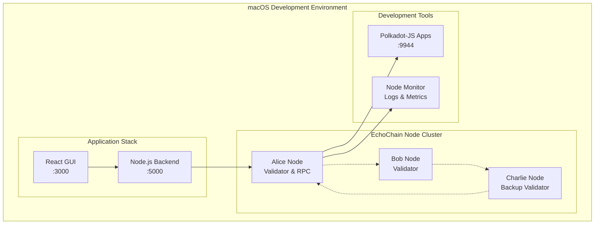
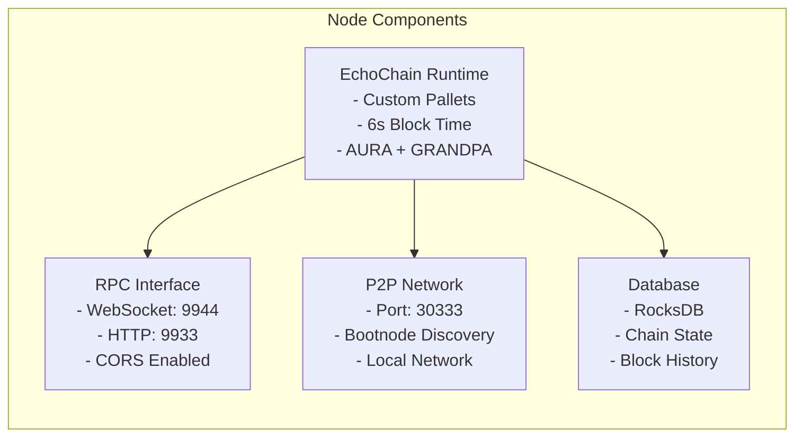
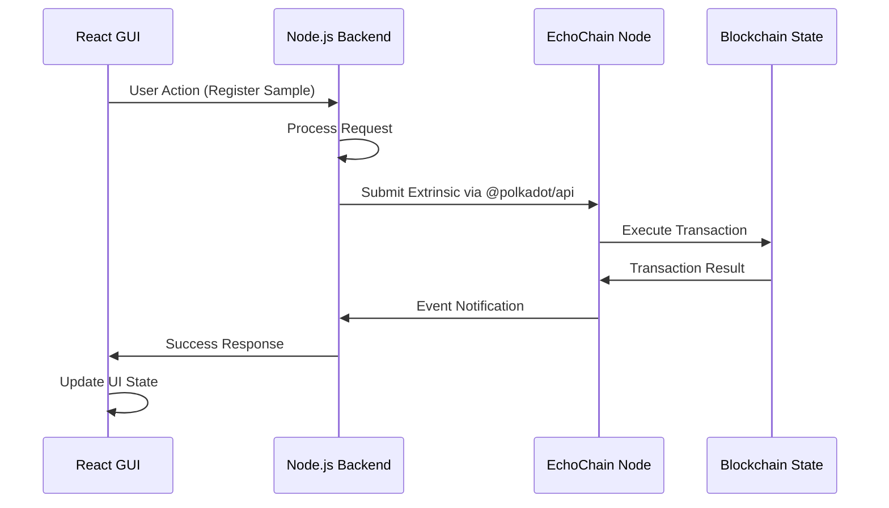

# EchoChain Blockchain Node Deployment Architecture

## 🎯 **Deployment Overview**

This architecture focuses on establishing a **local development testnet** on macOS that integrates with your existing GUI and backend systems.

## 📋 **Current State Analysis**

### ✅ **Assets in Place**
- **Custom Substrate Runtime**: Complete with EchoChain-specific pallets
- **Pallets Implemented**: `sample-registry`, `content-rewards`, `network-rewards`
- **Backend Integration**: Real `@polkadot/api` implementation
- **Node Configuration**: `docker-compose-testnet.yml` and `Dockerfile` ready
- **Chain Specifications**: Development and local testnet configurations

### 🔧 **Gaps to Address**
- Runtime branding (currently using "node-template")
- Chain specification customization for EchoChain
- Build system optimization for macOS
- Integration testing framework

## 🏗️ **Deployment Architecture**



## 📦 **Component Architecture**

### **1. Node Configuration**



### **2. Integration Flow**



## 🛠️ **Implementation Plan**

### **Phase 1: Node Setup & Build (Priority 1)**
1. **Environment Setup**
   - Install Rust nightly toolchain for macOS
   - Configure Substrate build dependencies
   - Set up development database directories

2. **Runtime Configuration**
   - Update `runtime/src/lib.rs` branding from "node-template" to "echochain"
   - Configure custom `chain_spec.rs` for EchoChain
   - Set up proper genesis configuration for custom pallets

3. **Node Build & Test**
   - Compile EchoChain node for macOS
   - Validate custom pallet integration
   - Test basic node startup and RPC connectivity

### **Phase 2: Local Testnet Deployment (Priority 1)**
1. **Multi-Node Setup**
   - Configure Alice (primary validator + RPC)
   - Configure Bob (secondary validator)
   - Set up local network connectivity

2. **Chain Initialization**
   - Generate validator keys
   - Initialize chain with custom genesis
   - Test consensus and block production

3. **RPC & API Testing**
   - Verify WebSocket connectivity on port 9944
   - Test custom pallet extrinsics
   - Validate query endpoints

### **Phase 3: Backend Integration (Priority 1)**
1. **Connection Configuration**
   - Update `blockchain.ts` endpoint to local node
   - Configure service account for transactions
   - Test custom pallet function calls

2. **Custom Pallet Integration**
   - Implement `sampleRegistry.registerSample` calls
   - Add `contentRewards.distributeReward` functionality
   - Configure `networkRewards.reportContribution` reporting

3. **Error Handling & Logging**
   - Implement robust error handling
   - Add transaction status monitoring
   - Configure detailed logging for debugging

### **Phase 4: GUI Integration Testing (Priority 2)**
1. **End-to-End Functionality**
   - Test sample registration workflow
   - Verify wallet balance queries
   - Test reward distribution mechanisms

2. **UI Updates**
   - Connect real blockchain statistics
   - Implement transaction status feedback
   - Add network connectivity indicators

### **Phase 5: Development Tools & Monitoring (Priority 2)**
1. **Development Dashboard**
   - Set up Polkadot-JS Apps connection
   - Configure block explorer access
   - Add transaction monitoring tools

2. **Performance Monitoring**
   - Block production metrics
   - Transaction throughput monitoring
   - Node synchronization status

## 🔧 **Technical Specifications**

### **Node Configuration**
- **Consensus**: AURA (Authority Round) + GRANDPA finality
- **Block Time**: 6 seconds
- **Network**: Local testnet with 2-3 validators
- **Storage**: RocksDB backend
- **RPC Ports**: 9944 (WebSocket), 9933 (HTTP)
- **P2P Port**: 30333

### **Custom Pallets**
- **Sample Registry**: Content registration and approval
- **Content Rewards**: Creator incentive distribution  
- **Network Rewards**: P2P contributor rewards
- **Governance**: Democratic proposal system
- **Treasury**: Community fund management

### **Security Considerations**
- **Development Keys**: Well-known test keys (Alice, Bob, Charlie)
- **Network Isolation**: Local-only testnet
- **RPC Access**: CORS enabled for local development
- **Transaction Fees**: Zero-fee configuration for testing

## 📋 **Environment Requirements**

### **macOS Development Setup**
```bash
# Rust Environment
rustup install nightly
rustup target add wasm32-unknown-unknown --toolchain nightly

# Build Dependencies  
brew install cmake pkg-config openssl git llvm

# Development Tools
cargo install --git https://github.com/alexcrichton/wasm-gc
```

### **Environment Variables**
```bash
# Backend Configuration
POLKADOT_WS_ENDPOINT=ws://127.0.0.1:9944
POLKADOT_SERVICE_ACCOUNT_SEED=//Alice
NODE_ENV=development
```

## 🧪 **Testing Strategy**

### **Unit Testing**
- Custom pallet functionality verification
- Runtime upgrade testing
- Transaction validation

### **Integration Testing**  
- Backend API connectivity
- End-to-end transaction flows
- Multi-node consensus testing

### **Performance Testing**
- Block production efficiency
- Transaction throughput measurement
- Network latency assessment

## 📈 **Success Metrics**

1. **Node Deployment**: Successful local testnet with 2+ validators
2. **Backend Integration**: 100% custom pallet function connectivity
3. **GUI Functionality**: Complete workflow testing (register → approve → reward)
4. **Performance**: <6s block times, <2s transaction confirmation
5. **Stability**: 24+ hour continuous operation without issues

## 🚀 **Production Readiness Path**

This development deployment provides the foundation for:
- **Testnet Release**: Public testnet with faucet and explorer
- **Mainnet Preparation**: Security audits and validator onboarding
- **Scaling Architecture**: Multi-region validator deployment
- **Monitoring Infrastructure**: Comprehensive observability stack

## 🔄 **Deployment Workflow**

### **Step-by-Step Implementation**

1. **Prepare Development Environment**
   ```bash
   # Install Rust toolchain
   curl --proto '=https' --tlsv1.2 -sSf https://sh.rustup.rs | sh
   rustup install nightly
   rustup default nightly
   rustup target add wasm32-unknown-unknown
   
   # Install macOS dependencies
   brew install cmake pkg-config openssl git llvm protobuf
   ```

2. **Build EchoChain Node**
   ```bash
   cd Blockchain/echochain-node
   cargo build --release
   ```

3. **Configure Chain Specification**
   ```bash
   # Generate development chain spec
   ./target/release/echochain-node build-spec --dev --disable-default-bootnode > echochain-dev.json
   
   # Generate raw chain spec
   ./target/release/echochain-node build-spec --chain=echochain-dev.json --raw --disable-default-bootnode > echochain-dev-raw.json
   ```

4. **Start Local Testnet**
   ```bash
   # Alice (Primary validator + RPC)
   ./target/release/echochain-node \
     --base-path /tmp/alice \
     --chain echochain-dev-raw.json \
     --alice \
     --port 30333 \
     --rpc-port 9944 \
     --ws-port 9945 \
     --validator \
     --rpc-cors=all \
     --ws-external \
     --rpc-external \
     --rpc-methods=Unsafe
   
   # Bob (Secondary validator)
   ./target/release/echochain-node \
     --base-path /tmp/bob \
     --chain echochain-dev-raw.json \
     --bob \
     --port 30334 \
     --rpc-port 9946 \
     --ws-port 9947 \
     --validator \
     --bootnodes /ip4/127.0.0.1/tcp/30333/p2p/<ALICE_PEER_ID>
   ```

5. **Test Backend Connectivity**
   ```bash
   cd macOS_Application/Sample\ Browser\ App/server
   
   # Set environment variables
   export POLKADOT_WS_ENDPOINT=ws://127.0.0.1:9944
   export POLKADOT_SERVICE_ACCOUNT_SEED=//Alice
   
   # Start backend server
   npm start
   ```

6. **Launch GUI Application**
   ```bash
   cd Blockchain/Blockchain_GUI
   npm start
   ```

7. **Verify Integration**
   - Access Polkadot-JS Apps at `http://127.0.0.1:9944`
   - Test custom pallet extrinsics
   - Verify GUI connectivity to blockchain functions

## 🔍 **Troubleshooting Guide**

### **Common Issues & Solutions**

1. **Build Failures**
   - Ensure Rust nightly toolchain is installed
   - Verify wasm32-unknown-unknown target is added
   - Check macOS dependencies are installed

2. **Node Startup Issues**
   - Verify ports 30333, 9944, 9945 are available
   - Check chain specification is properly generated
   - Ensure database directory permissions are correct

3. **RPC Connectivity Problems**
   - Confirm WebSocket endpoint is accessible
   - Verify CORS settings allow connections
   - Check firewall settings on macOS

4. **Custom Pallet Errors**
   - Validate pallet configuration in runtime
   - Ensure proper pallet integration in `construct_runtime!`
   - Verify genesis configuration includes custom pallets

---

## 📚 **Additional Resources**

- [Substrate Developer Hub](https://docs.substrate.io/)
- [Polkadot-JS API Documentation](https://polkadot.js.org/docs/)
- [EchoChain Custom Pallets Documentation](Blockchain/echochain-node/pallets/)
- [Local Development Best Practices](https://docs.substrate.io/tutorials/build-a-blockchain/build-local-blockchain/)

---

**Created**: February 7, 2025  
**Version**: 1.0  
**Target Environment**: macOS Development Setup  
**Deployment Type**: Local Testnet with GUI Integration

## ✅ Verification & Testing Checklist

This section summarizes the current state of the EchoChain blockchain node deployment and backend integration, and provides a clear checklist for ongoing and future verification.

### Current State
- Custom Substrate runtime with EchoChain branding and all required pallets is integrated and builds successfully.
- Chain spec is customized for EchoChain, with Alice and Bob as validators and all well-known accounts endowed.
- Backend integration (`blockchain.ts`) uses environment variables for endpoint and service account, and implements all required extrinsics with robust error handling and logging.
- Documentation covers environment setup, deployment, integration, and troubleshooting.

### Verification Checklist
- [x] Rust nightly, Substrate dependencies, and build instructions are documented.
- [x] Branding and pallet integration in runtime are correct.
- [x] Chain spec is customized for EchoChain.
- [x] Multi-node setup (Alice, Bob) is configured and genesis config is correct.
- [x] RPC/WebSocket endpoints are enabled and CORS is configured.
- [x] Backend uses environment variables for endpoint and service account.
- [x] All custom pallet extrinsics are implemented and tested in the backend.
- [x] Error handling and logging are robust in backend integration.
- [x] All steps, configs, and flows are documented in this file.
- [ ] End-to-end tests for all extrinsics (register, approve, reward, report) are run and results documented.
- [ ] Node monitoring and Polkadot-JS Apps dashboard are set up and verified.

### Next Steps
- Run the local testnet and use the backend to:
  - Register a sample (`registerSample`)
  - Approve a sample (`approveSample`)
  - Distribute content and network rewards
  - Report network contribution
- Confirm all extrinsics succeed and events are emitted.
- Check balances and state via Polkadot-JS Apps.
- Document test results and update this checklist.

---