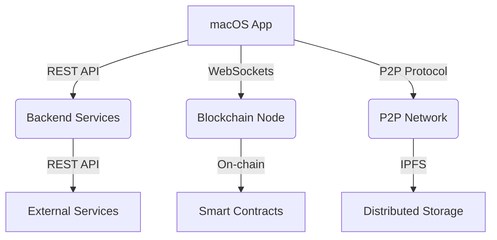
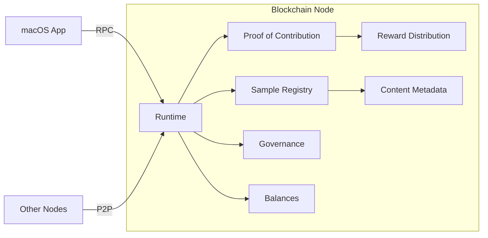
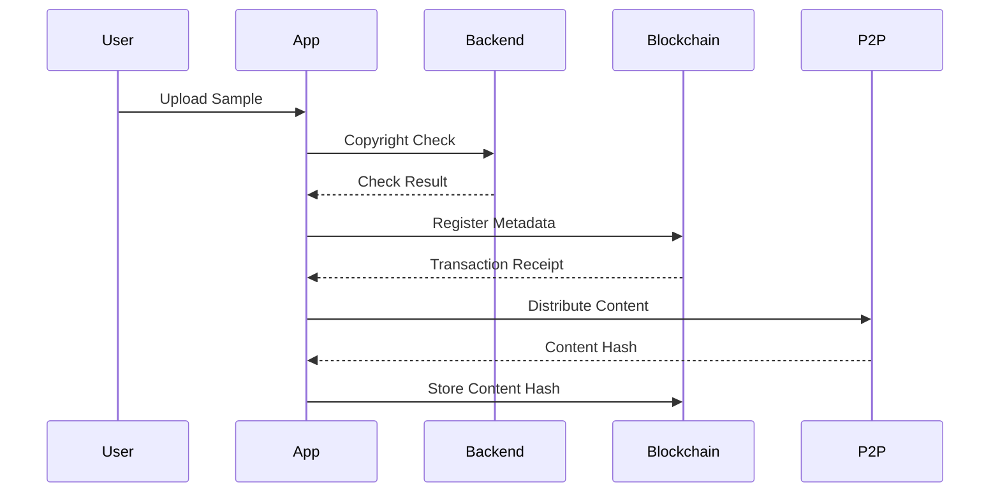

# EchoChain System Architecture

## Overview

## Blockchain Component Architecture

## Data Flow

## Key Components

### 1. macOS Application
- **Responsibilities**:
  - User interface and experience
  - Wallet management
  - Sample browsing/uploading
  - P2P client integration

### 2. Backend Services
- **Responsibilities**:
  - User authentication
  - Copyright verification
  - API integrations
  - Caching layer

### 3. Blockchain Node
- **Responsibilities**:
  - Content registration
  - Proof of Contribution consensus
  - Reward distribution
  - Governance

### 4. P2P Network
- **Responsibilities**:
  - Distributed content storage
  - Content discovery
  - Efficient data transfer

## Interaction Patterns

1. **Sample Upload Flow**:
   - Content checked via Backend
   - Metadata recorded on Blockchain
   - Content distributed via P2P
   - Content hash stored on-chain

2. **Reward Distribution**:
   - Contributions tracked on-chain
   - Periodic reward calculations
   - Automated payouts

3. **Governance**:
   - On-chain proposals
   - Voting mechanisms
   - Parameter updates