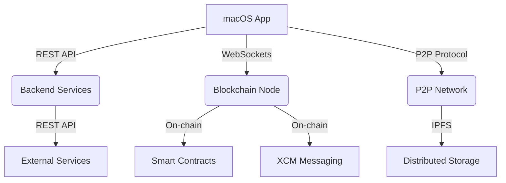

# Architecture Overview

> **See also:** [Echochain Blockchain Spec](./echochain-blockchain.md), [Main Documentation Index](./README.md)

# EchoChain System Architecture

## Overview



## Blockchain Component Architecture

```