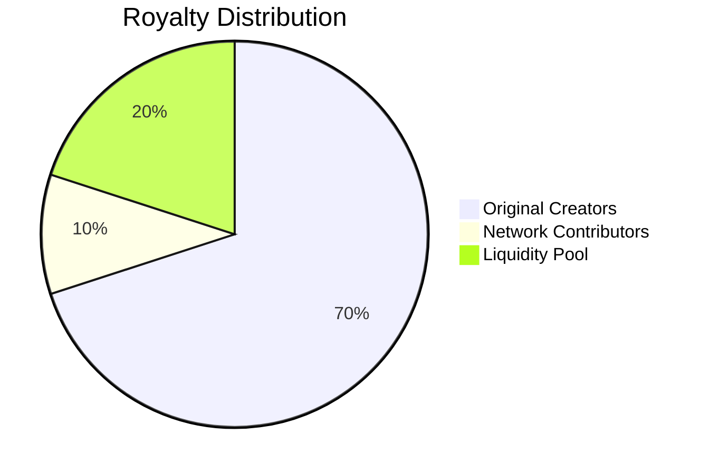
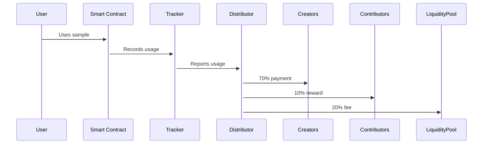

# Dynamic Royalty Distribution System

## Token Allocation Structure

## Technical Implementation

### 1. Smart Contract Architecture
- **RoyaltyDistributor.sol**: Main distribution logic
- **SampleNFT.sol**: ERC-721 with minimal metadata
- **UsageTracker.sol**: Records sample plays/usage

### 2. Core Features
- **Automated Payouts**:
  - Triggered by usage events
  - Split according to allocation percentages
  - Weekly distribution cycles

- **Minimal On-Chain Storage**:
  - Store only essential NFT metadata on-chain
  - Offload sample files to IPFS
  - Merkle proofs for verification

### 3. Token Flow

### 4. Optimization
- Batch payments to reduce gas costs
- Layer 2 solution for scaling
- Off-chain computation with on-chain verification